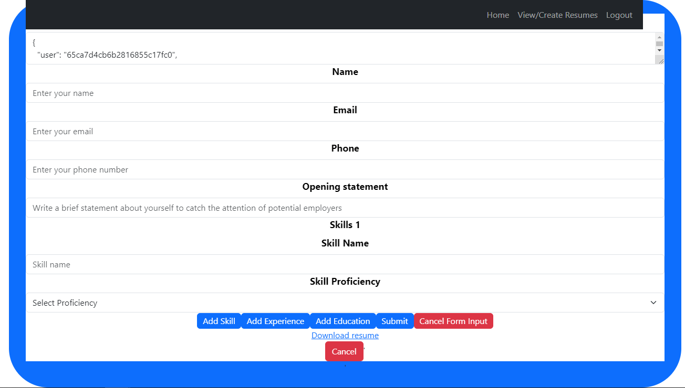
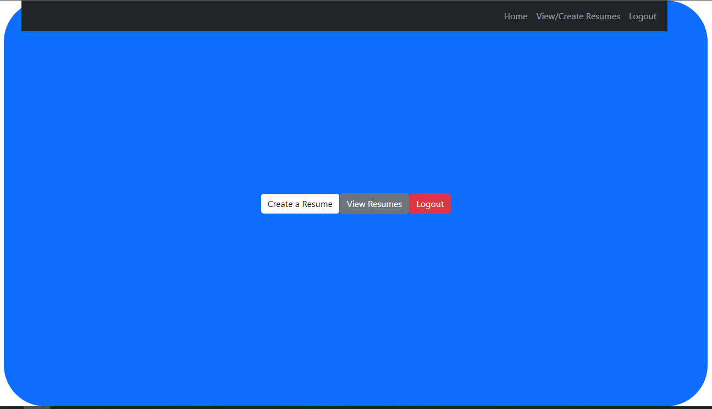
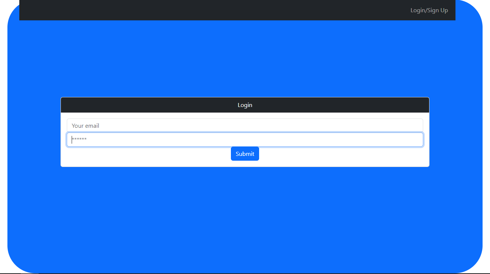
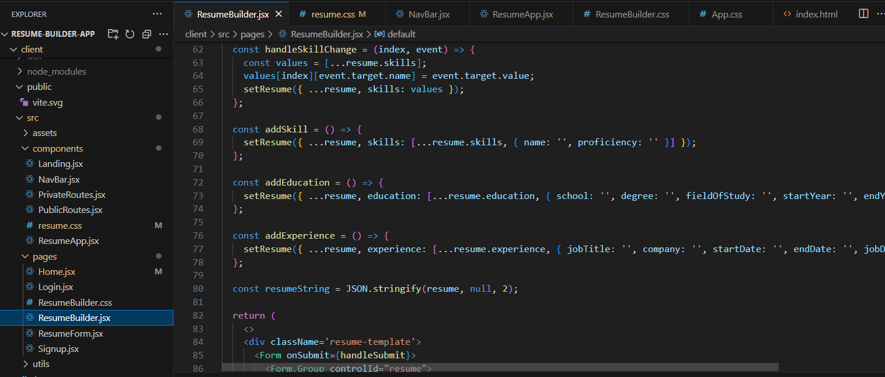

# Resume Builder Project

## Description
A web based application that allows users to easily create and store resumes.

## Usage
-Create an account
-Log into your account
-Select CREATE A RESUME
-Follow along and fill out all of the sections for your resume
-Click SUBMIT
-Select "Download resume" to save your resume

OR

-Select view resumes after login if you have already created one

## Screenshots

## Credits

This is the group project by Michael Arrasmith [LINK](https://github.com/MArrasmith), Nicholas Reel [LINK](https://github.com/Steelerforreel), and Nick Wilson [LINK](https://github.com/KC-Nick/). 